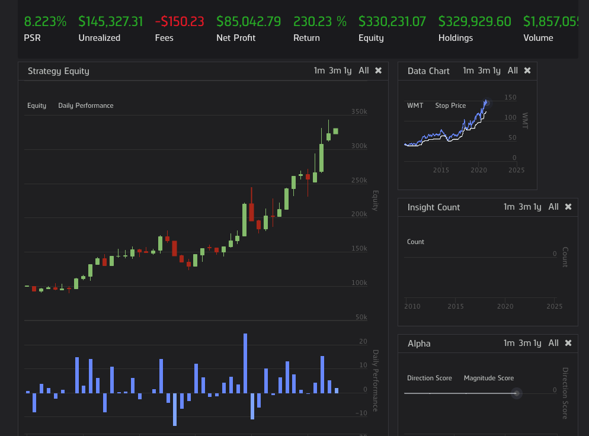

# Breakout-Trading-Bot
This stock trading bot that algorithmically places trades on a passed in stock. It Identifies breakouts by comparing the current price to the previous highs within a dynamically calculated look back length based on volume. It then places the order if it detects the breakout with a strict trailing stop loss in order to minimize losses. The bot was able to make 230% returns when backtested on Walmart stock from January 2nd, 2010 till January 4, 2021! Therefore, it successfully beat the market by 63%!

# Proof of Backtest

